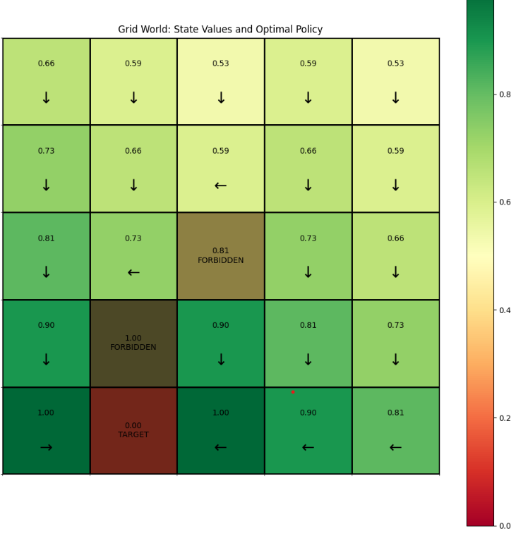
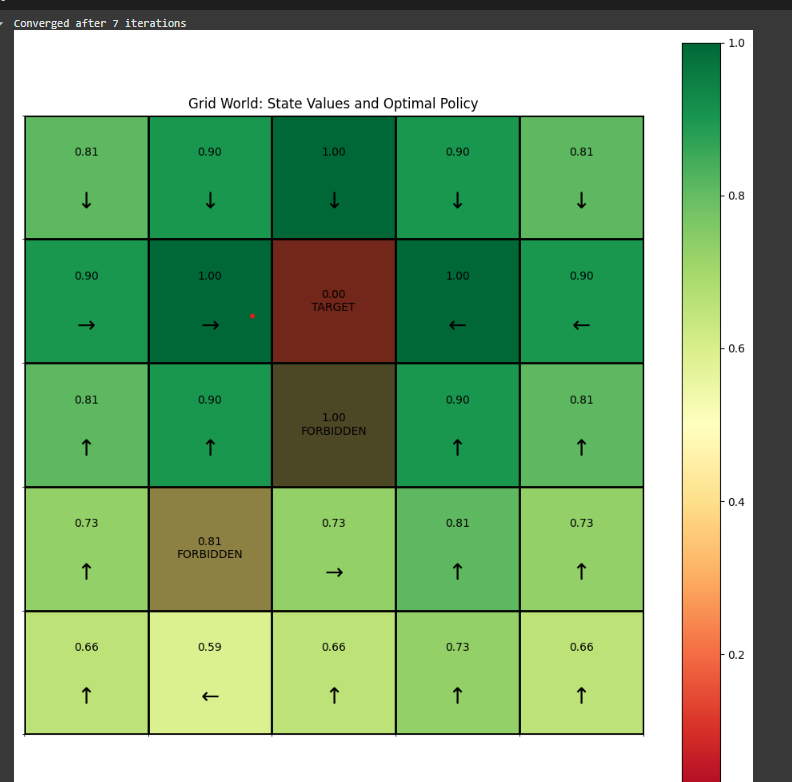
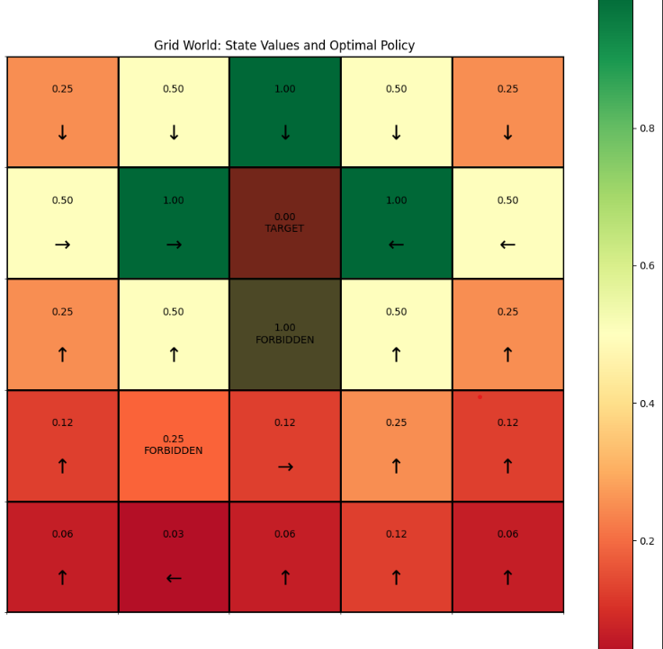

# Reinforcement_learning
Learning RL from scratch

1) Value Iteration Algorithm implementation on 5*5 grid world example.
The state values changes as the we change gamma value.

Target is 21st state

Target is changed to 7th State

Changed the gamma to 0.5

